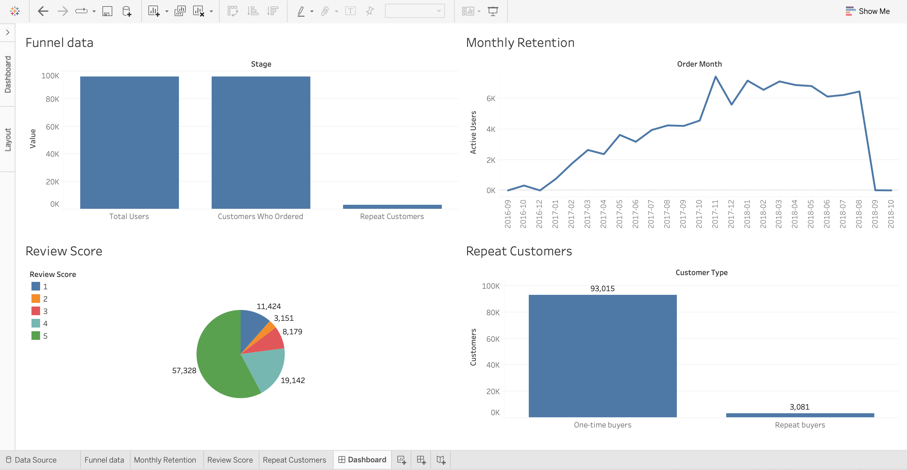

# E-commerce Product Analytics Project

This project analyzes customer behavior using the Brazilian Olist e-commerce dataset.

Tools used:
- MySQL (data analysis)
- Tableau (data visualization)

Key analyses:
- User funnel
- Monthly retention trends
- Customer review distribution
- Repeat vs one-time buyers

Insights:
- Most customers purchase only once, indicating low retention. 
- Review score distribution suggests generally positive satisfaction but repeat purchasing remains low.

Dashboard Preview:

Live Dashboard: https://public.tableau.com/app/profile/anshita.g4276/viz/olist_ecommerce_analysis/Dashboard?publish=yes
